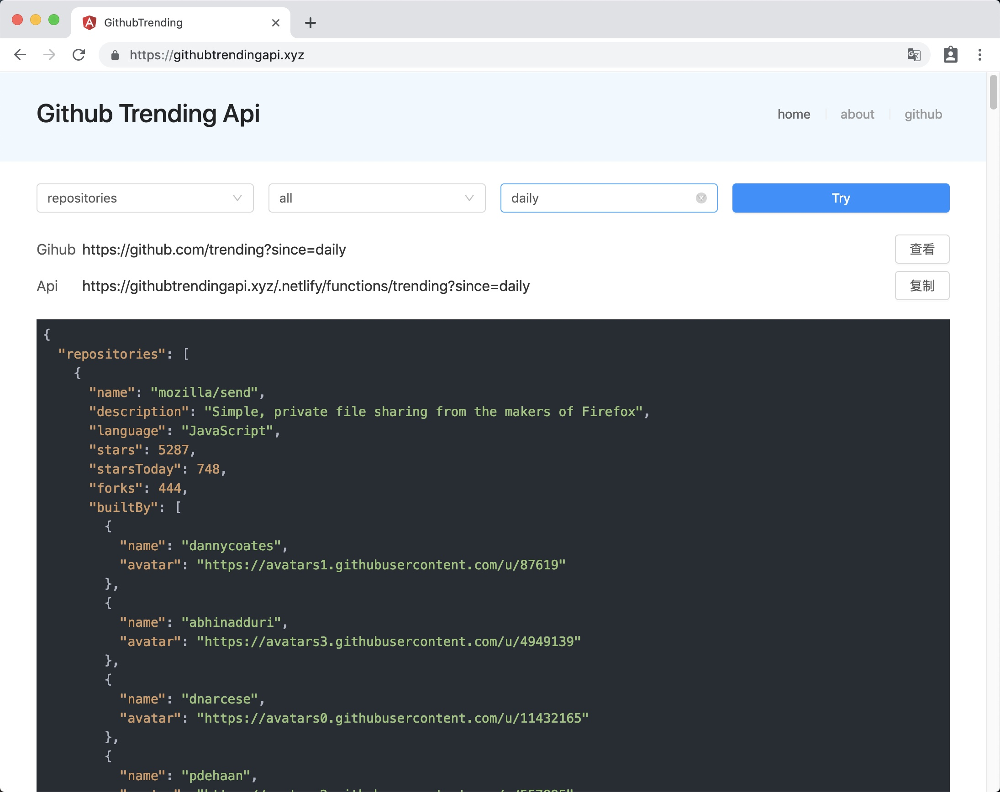

# Github Trending Api

> Github trending data api

[](https://app.netlify.com/sites/gallant-poincare-023ef3/deploys)



[Link](https://githubtrendingapi.xyz)

## Develop

```sh
npm install           ## project setup

npm run serve         ## compiles and hot-reloads for development

npm run lambda:serve  ## setup lambda functions development

npm run build         ## compiles and minifies for production

npm run lambda:build  ## build lambda functions
```

## Contributing

1. Fork it (<https://github.com/xrr2016/github-trending-api.git>)
2. Create your feature branch (`git checkout -b feature/fooBar`)
3. Commit your changes (`git commit -am 'Add some fooBar'`)
4. Push to the branch (`git push origin feature/fooBar`)
5. Create a new Pull Request

## License

[MIT](LICENSE)
